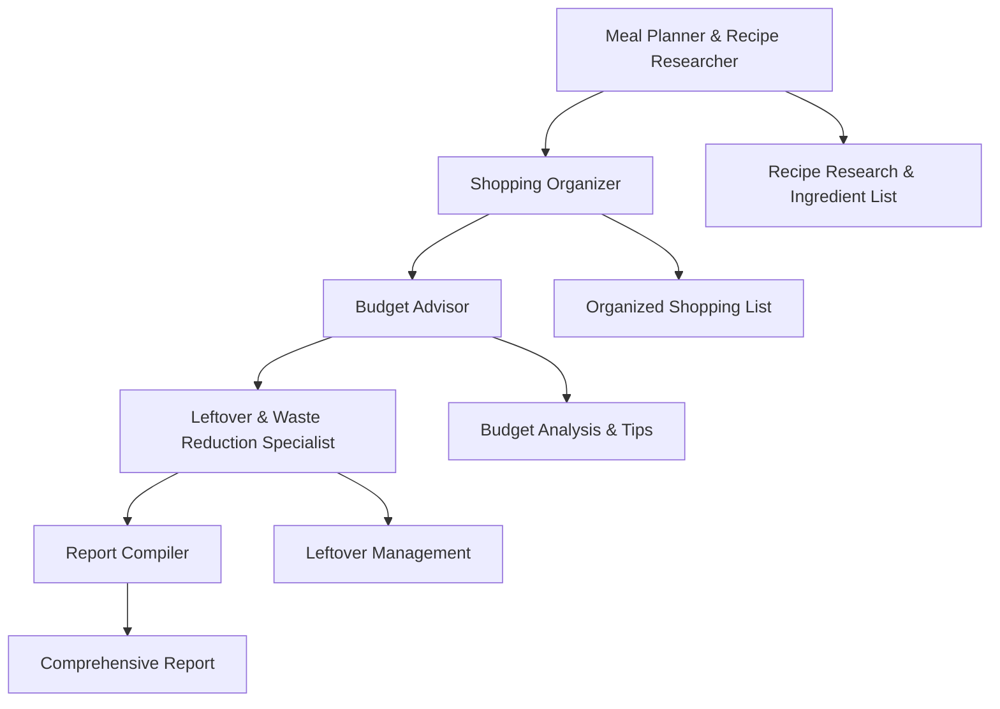

# Meal Grocery Planner with CrewAI

[](https://python.org)
[](https://github.com/joaomdmoura/crewAI)
[](https://openai.com/)
[](https://opensource.org/licenses/MIT)

## 🍽️ Project Overview

The **Meal Grocery Planner with CrewAI** is an intelligent meal planning and grocery shopping assistant that leverages the power of AI agents to create comprehensive meal plans, organized shopping lists, budget analysis, and leftover management suggestions. This system uses CrewAI's multi-agent framework to provide a complete meal planning solution that considers dietary restrictions, cooking skill levels, and budget constraints.

## ✨ Key Features

### 🤖 AI-Powered Multi-Agent System
- **Meal Planner & Recipe Researcher**: Searches for optimal recipes online considering dietary needs and skill levels
- **Shopping Organizer**: Organizes ingredients into structured shopping lists by store sections
- **Budget Advisor**: Provides cost estimates, price analysis, and money-saving tips
- **Leftover & Waste Reduction Specialist**: Suggests creative ways to use leftover ingredients
- **Report Compiler**: Generates comprehensive meal planning guides

### 🎯 Smart Planning Capabilities
- **Dietary Restriction Support**: Accommodates various dietary needs (nut-free, low-sodium, etc.)
- **Skill Level Adaptation**: Recipes tailored for beginner, intermediate, and advanced cooks
- **Budget Management**: Keeps meal plans within specified budget constraints
- **Waste Reduction**: Minimizes food waste through intelligent leftover management

### 📊 Comprehensive Output
- Complete recipes with step-by-step cooking instructions
- Organized shopping lists grouped by store sections
- Detailed price estimates and budget breakdowns
- Money-saving tips and alternatives
- Creative leftover recipe suggestions

## 🚀 Getting Started

### Prerequisites

- Python 3.8 or higher
- OpenAI API key
- Serper API key (for web search functionality)

### Installation

1. **Clone the repository**
   ```bash
   git clone https://github.com/AliAbdallah21/Meal-Grocery-Planner-with-CrewAI.git
   cd Meal-Grocery-Planner-with-CrewAI
   ```

2. **Install required packages**
   ```bash
   pip install langchain langchain-community langchain-openai crewai crewai-tools databricks-sdk duckduckgo-search
   ```

3. **Set up environment variables**
   ```python
   import os
   os.environ["OPENAI_API_KEY"] = "your-openai-api-key"
   os.environ["SERPER_API_KEY"] = "your-serper-api-key"
   ```

4. **Download required configuration files**
   ```bash
   # The system will automatically download necessary configuration files
   # agents.yaml and tasks.yaml will be fetched during execution
   ```

## 📖 Usage

### Basic Usage

```python
from crewai import LLM
from leftover import LeftoversCrew

# Initialize LLM
llm = LLM(
    model="gpt-4o",
    api_key="your-openai-api-key"
)

# Create and run the complete meal planning crew
complete_result = complete_grocery_crew.kickoff(
    inputs={
        "meal_name": "Chicken Stir Fry",
        "servings": 4,
        "budget": "$25",
        "dietary_restrictions": ["no nuts", "low sodium"],
        "cooking_skill": "beginner"
    }
)

print(complete_result)
```

### Input Parameters

| Parameter | Type | Description | Example |
|-----------|------|-------------|---------|
| `meal_name` | str | Name of the desired meal | "Chicken Stir Fry" |
| `servings` | int | Number of people to serve | 4 |
| `budget` | str | Budget constraint | "$25" |
| `dietary_restrictions` | list | Dietary limitations | ["no nuts", "low sodium"] |
| `cooking_skill` | str | Cooking experience level | "beginner", "intermediate", "advanced" |

## 🏗️ System Architecture

### Agent Roles and Responsibilities



### Data Models

The system uses Pydantic models for structured data handling:

- **GroceryItem**: Individual grocery items with quantity, price, and category
- **MealPlan**: Recipe details with difficulty level and ingredients
- **ShoppingCategory**: Store sections with grouped items and totals
- **GroceryShoppingPlan**: Complete shopping plan with budget and tips

## 📊 Sample Output

Here's an example of the system's comprehensive meal planning guide:

### Recipe Overview
- **Dish Name**: Easy 5-star Chicken Stir Fry
- **Difficulty Level**: Beginner
- **Servings**: 4
- **Total Estimated Cost**: $12.89

### Organized Shopping List
- **Produce**: $4.39 (snap peas, bell pepper, carrots, garlic, ginger)
- **Meat**: $4.00 (chicken breast)
- **Grains**: $1.00 (rice)
- **Condiments & Spices**: $3.50 (oils, sauces, seasonings)

### Budget Analysis
- Money-saving tips included
- Alternative ingredient suggestions
- Pantry check recommendations

### Leftover Management
- 5 creative recipes for leftover ingredients
- Waste reduction strategies
- Storage recommendations

## 🛠️ Customization

### Adding New Agents

```python
custom_agent = Agent(
    role="Custom Role",
    goal="Custom goal description",
    backstory="Agent background story",
    tools=[SerperDevTool()],
    llm=llm,
    verbose=False
)
```

### Creating Custom Tasks

```python
custom_task = Task(
    description="Task description with {input_variables}",
    expected_output="Description of expected output",
    agent=custom_agent,
    output_pydantic=CustomModel,
    output_file="output.json"
)
```

## 🧪 Testing

The project includes comprehensive examples demonstrating:

1. **Single Meal Planning**: Basic recipe research and planning
2. **Two-Agent Shopping**: Meal planning with organized shopping lists
3. **Complete System**: Full meal planning with all agents and features

Run the examples to test different system components:

```python
# Test single meal planning
meal_planner_result = meal_planner_crew.kickoff(inputs)

# Test shopping organization
shopping_result = two_agent_grocery_crew.kickoff(inputs)

# Test complete system
complete_result = complete_grocery_crew.kickoff(inputs)
```

## 🤝 Contributing

Contributions are welcome! Please feel free to submit a Pull Request. For major changes, please open an issue first to discuss what you would like to change.

### Development Setup

1. Fork the repository
2. Create a feature branch (`git checkout -b feature/AmazingFeature`)
3. Commit your changes (`git commit -m 'Add some AmazingFeature'`)
4. Push to the branch (`git push origin feature/AmazingFeature`)
5. Open a Pull Request

## 📄 License

This project is licensed under the MIT License - see the [LICENSE](LICENSE) file for details.

## 🙏 Acknowledgments

- [CrewAI](https://github.com/joaomdmoura/crewAI) for the multi-agent framework
- [OpenAI](https://openai.com/) for GPT-4 language model capabilities
- [Serper](https://serper.dev/) for web search functionality
- [Budget Bytes](https://www.budgetbytes.com/) for recipe inspiration

## 🐛 Known Issues

- Web search functionality requires active internet connection
- API rate limits may affect performance with frequent requests
- Price estimates may vary by location and store

## 🗺️ Roadmap

- [ ] Add support for multiple meal planning
- [ ] Implement nutritional analysis
- [ ] Add meal prep scheduling features
- [ ] Create mobile app interface
- [ ] Add multi-language support

## 📞 Contact Information

**Ali Abdallah**

- **GitHub**: [@AliAbdallah21](https://github.com/AliAbdallah21)
- **LinkedIn**: [Connect with me](https://linkedin.com/in/your-profile)
- **Email**: [your-email@domain.com](mailto:your-email@domain.com)

---

## 📈 Project Stats


**⭐ Star this repository if you find it helpful!**
